# Qwen3.8 Flash-Next: a mid48 repack of the mixed 4/8-bit pack

A request to repack `ddalcu/Qwen3.8-Flash-Next-MLX-Serve-mixed-4-8bit` with a narrower 8-bit set.
mid48 keeps 8-bit only on the tensors where errors steer the model and moves the rest of the
non-expert projections to 4-bit. It needs no code change: `tests/requant_qwen4_pack.py` builds it
from the published pack with a different `--keep` list.

All numbers are from one M5 Ultra (256 GB, macOS 27.0), serving with `--mtp --mtp-typical 0.2`.

## What changes

```
non-expert quantized weights (4.40 GB at 8-bit in mixed-4-8bit)

kept 8-bit  1.52 GB  lm_head, embed_tokens, hyper_connection, router gate (mlp.gate),
                     GDN in_proj_a / in_proj_b, attention k_proj / v_proj, indexer, PLE, MTP head
to 4-bit    2.88 GB  GDN in_proj_qkv / in_proj_z / out_proj, attention q_proj / o_proj,
         -> 1.44 GB  shared expert

routed experts (switch_mlp), the n-gram table and bf16 tensors: unchanged
```

| pack | safetensors |
|---|---:|
| mixed-4-8bit | 75.30 GB |
| mid48 | 73.86 GB |

## Results

GPU time per forward from `MLX_SERVE_DECODE_FWD_UBENCH`, same boot; accuracy with 4 concurrent
streams. A second mixed-4-8bit run with identical settings is the noise floor, since MTP typical
acceptance and batching partners make greedy output vary run to run.

| | mixed-4-8bit run 1 | mixed-4-8bit run 2 | mid48 |
|---|---:|---:|---:|
| S=1 forward | | | -11.2% |
| S=4 verify forward | | | -4.9% |
| MMLU-Pro-400 | 340 | 338 | 346 |
| answers at the 8,192-token cap | 3 | 4 | 3 |
| output tokens vs run 1 | | +2.9% | +4.7% |
| coding set | 4/6 | 5/6 | 4/6 |
| decode per request, 4 streams | 39.1 t/s | 38.9 t/s | 39.0 t/s |

An all-4-bit non-expert pack went further (-14.7% S=1) but wrote 12.8% more tokens and hit the
token cap on 7 questions, so the hyper-connections, router gate and small GDN projections stay
8-bit here.

The faster forward doesn't show up in 4-stream decode. The joined verify kernels
(`verifyJoinedProjection`) take 8-bit weights only, so mid48's 4-bit projections fall back to
per-request verify, which gives the gain back. Letting 4-bit
weights through `verifyQmm` measured +4.8% at 4 streams in a probe, but isn't bit-exact against
the solo path, so it isn't part of this request.

## Agent runs

ddalcu's voxel pagoda prompt under headless pi, `--thinking high`, on #614 (lookup drafts take
exact acceptance), arms in A B B A order:

| run | wall | turns | output tokens | loop-stops | tests | build |
|---|---:|---:|---:|---:|---:|---|
| mixed-4-8bit 1 | 51 min | 303 | 340,862 | 0 | 161 pass | ok |
| mid48 1 | 22 min | 116 | 152,142 | 0 | 71 pass | ok |
| mid48 2 | 47 min | 257 | 315,536 | 1 | 87 pass | ok |
| mixed-4-8bit 2 | 41 min | 177 | 278,580 | 0 | 222 pass | ok |

One cost to weigh: mid48 declares the task done sooner. Across 18 runs per pack on several builds,
the runs without a loop-stop (7 on mid48, 12 on mixed-4-8bit) ended at a median of 116 turns
against 216, with 1,557 source lines against 4,326. The scenes don't rank by pack, though: the
best-looking one below is mid48 2 and the plainest is mid48 1.

## The scenes

Each scene was built with `npm run build`, served with `vite preview`, and captured in headless
Chrome at 1280x800. Captures are 30 seconds apart, half of the 60-second day.

| run | first capture | +30 s |
|---|---|---|
| mid48 1 | 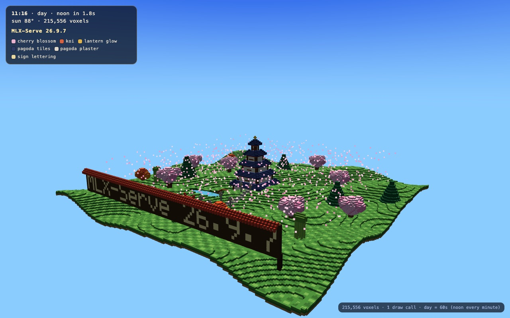 | 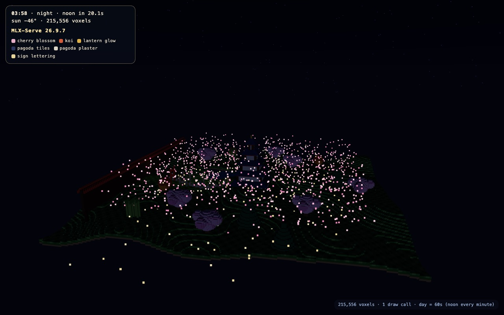 |
| mid48 2 | 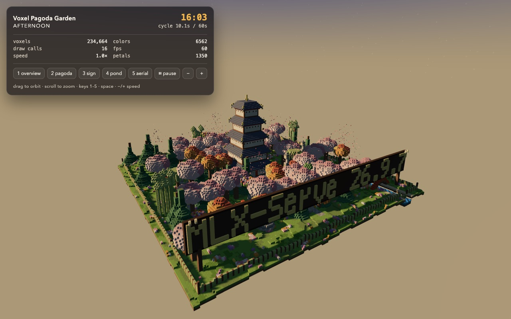 | 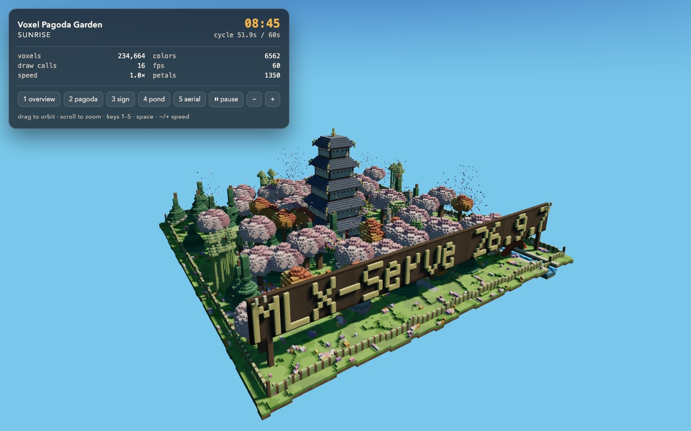 |
| mixed-4-8bit 1 | 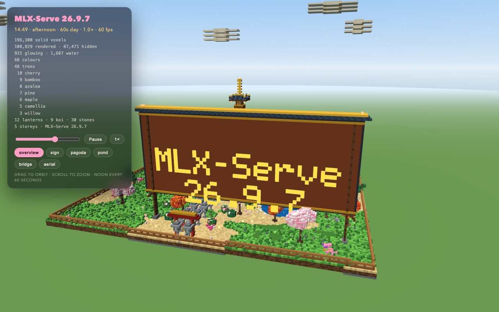 | 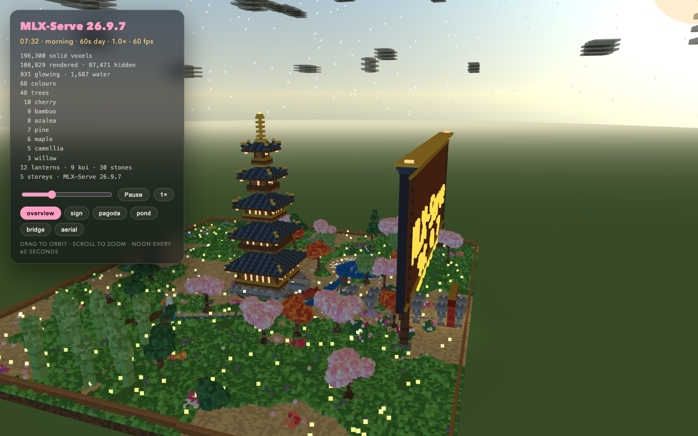 |
| mixed-4-8bit 2 | 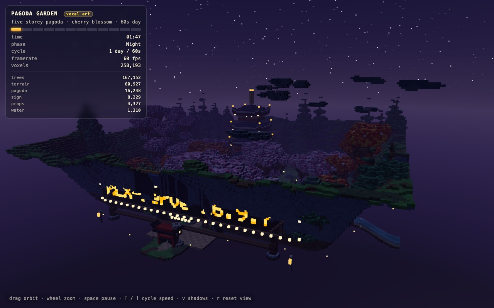 | 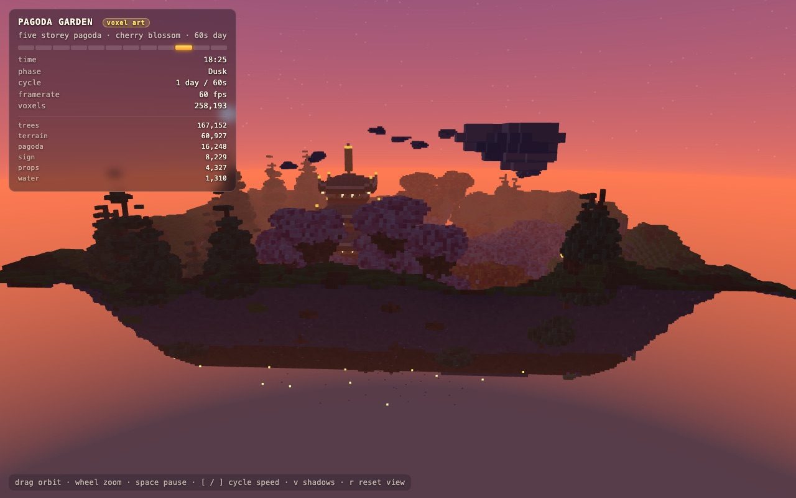 |

mixed-4-8bit 2 orbits its camera and started at night, so here is one more day cycle of it, 9
seconds apart:

| | | |
|---|---|---|
| 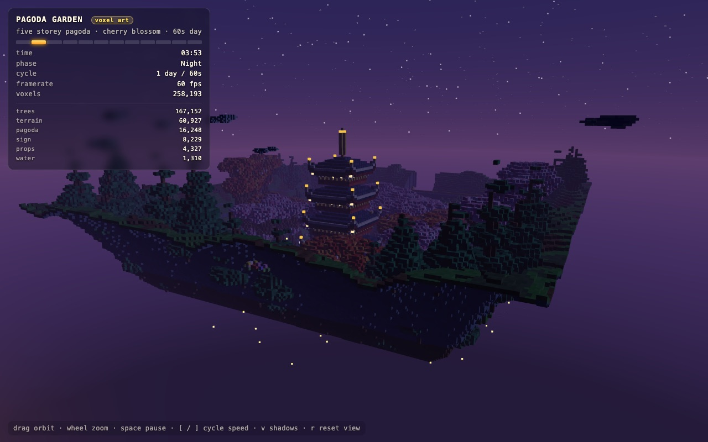 | 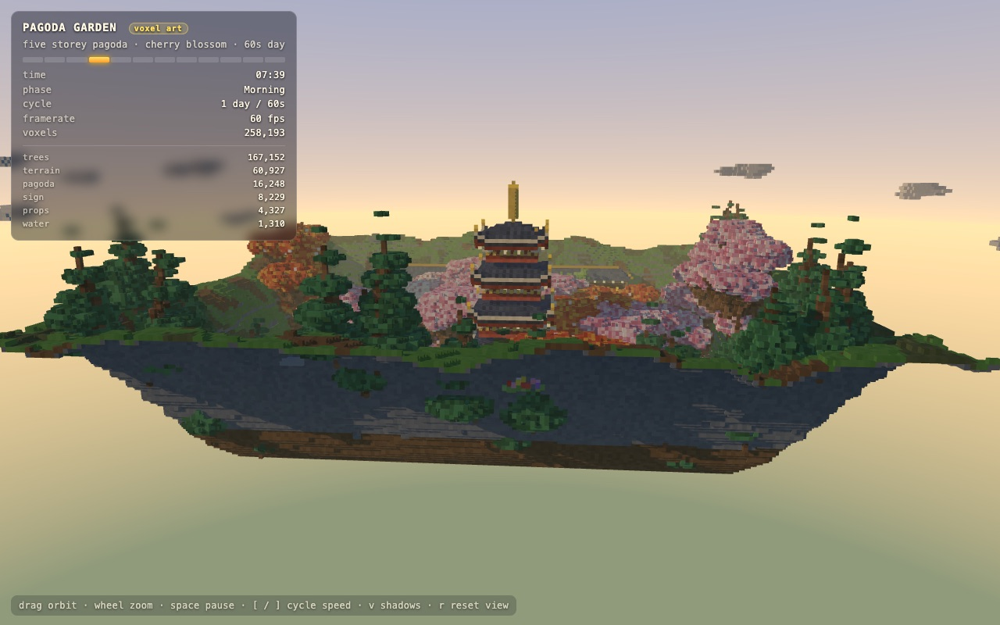 | 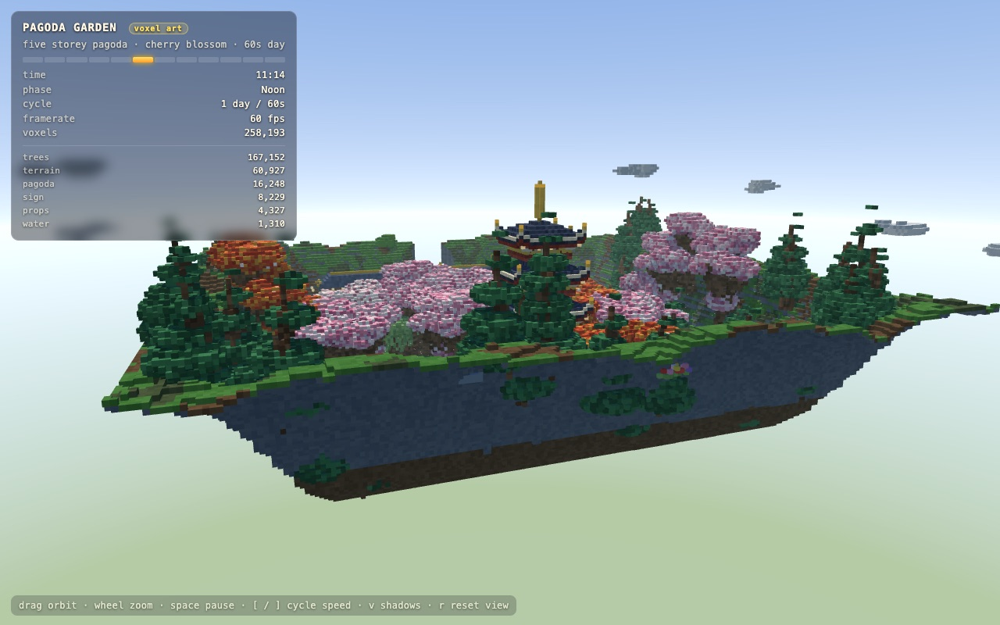 |
| 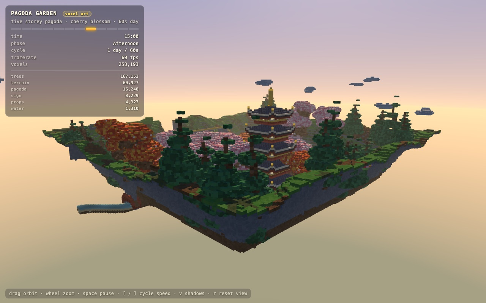 | 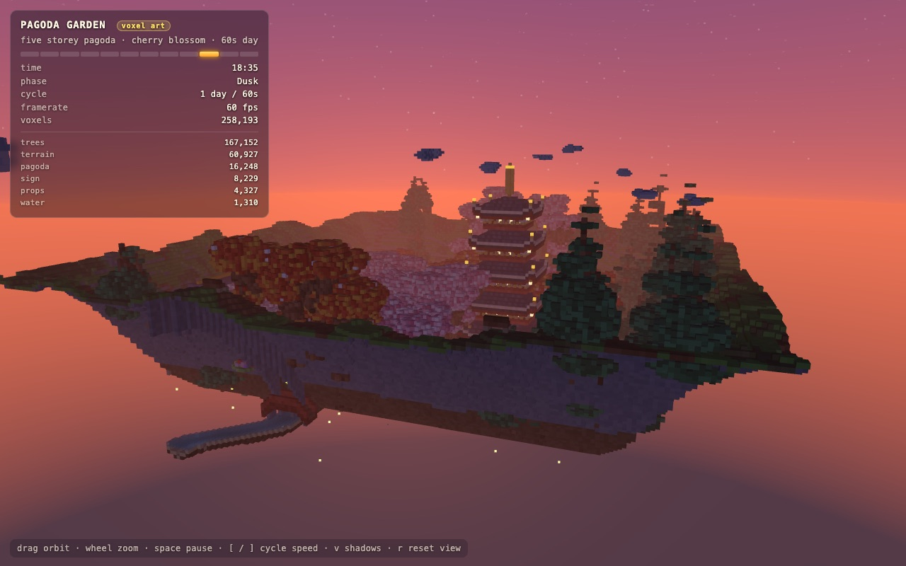 | 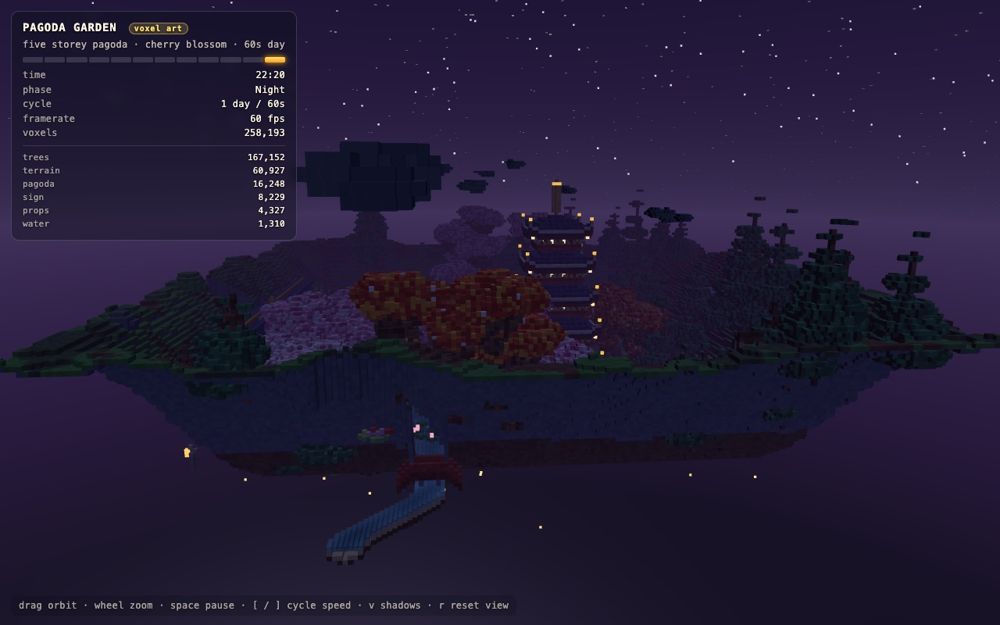 |

## How to build it

`tests/requant_qwen4_pack.py` needs `mlx` and `numpy`, and reads the published pack in place.
Put `--dst` on the same volume as `--src`: the 32 GB `ngram_table.bin` is hard-linked when it can
be, and copied when it can't.

```sh
python3 tests/requant_qwen4_pack.py \
  --src ~/models/Qwen3.8-Flash-Next-MLX-Serve-mixed-4-8bit \
  --dst ~/models/Qwen3.8-Flash-Next-MLX-Serve-mid48 \
  --from-bits 8 --to-bits 4 \
  --keep "lm_head,embed_tokens,hyper_connection,mlp.gate,in_proj_a,in_proj_b,indexer,k_proj,v_proj,ple.,.mtp.,mtp."
```

It requantizes every 8-bit affine tensor that matches none of the `--keep` substrings and isn't a
routed expert, copies everything else, and prints how many tensors it converted and how many GB it
saved. It also sets `quantization.bits` in `config.json` to 4. mlx-serve reads each tensor's width
from its own geometry, so the 8-bit tensors that were kept still load as 8-bit.

To check the result, serve it and compare the pack sizes above:

```sh
mlx-serve --serve --model ~/models/Qwen3.8-Flash-Next-MLX-Serve-mid48 --mtp --mtp-typical 0.2
```
